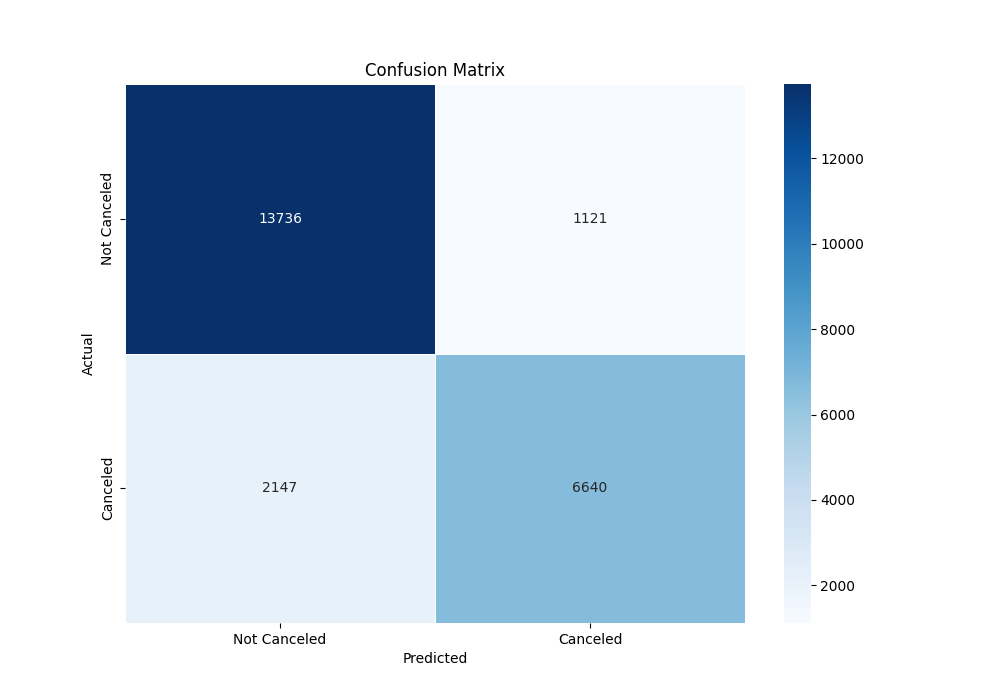

# Information about dataset
A dataset was taken from [Kaggle](https://www.kaggle.com/datasets/mojtaba142/hotel-booking?resource=download).

# Goal of the project
The goal of this project is to predict whether a hotel booking will be 
canceled or not based on various features provided in booking dataset.

# Preprocessing data
For preprocessing the data, I used the feature importance method to select the most relevant features for the model.
At the begging, I encoded categorical features using categorical encoding and got rid of the irrelevant features 
(like email, number, name and credit card) and features with too many missing values (like company and agent). 
Then I encoded the remaining categorical features using one-hot encoding.
(one-hot encoding from _pd.get_dummies_ function).

The result of the feature importance method is as follows:

After that we can use the most important features for our model. 

# Comparing Models

To find the best model for hotels task, I trained four different models: 
- Logistic Regression 
- Random Forest
- Naive Bayes
- SVM

Results of the models on testing data are shown in the table below.

| Model               | Precision | Recall | F1 Score |
|---------------------|-----------|--------|----------|
| Logistic Regression | 0.793     | 0.764  | 0.738    |
| Random Forest       | 0.861     | 0.862  | 0.860    |
| Naive Bayes         | -         | -      | -        |
| SVM                 | 0.741     | 0.744  | 0.733    |

For this task the 'accuracy method here' is more important than others because 
a missed cancellation (false positive) is more costly than a wrong cancellation (false negative).

Below you can find confusion matrices for all models which we trained in this project.

The confusion matrix for Random Forest with 100 estimators.

The confusion matrix for Logistic Regression with those parameters: 
`solver='liblinear', max_iter=500, penalty='l1', random_state=239, C=20`

The confusion matrix for Support Vector Machine with parameters: 
`(kernel='rbf', random_state=239, C=10, gamma='scale')`

Due to the laptop specifications, I was not able to tune hyperparameters of models, but I've written a function 
which allows to tune hyperparameters using GridSearchCV and can be used in this project.

# Overall
